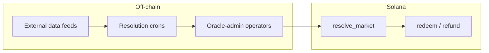
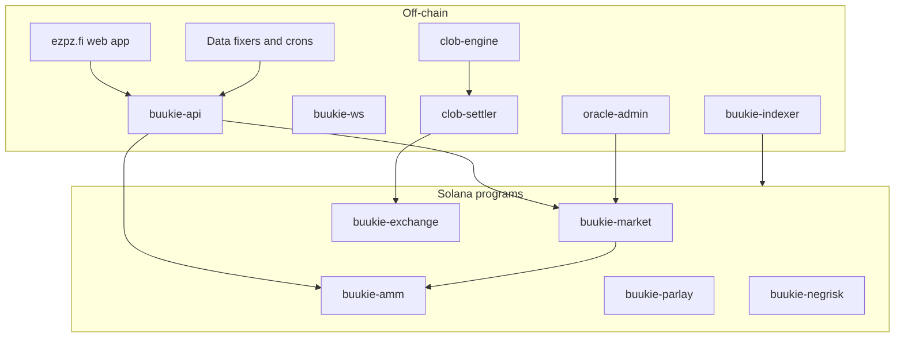

This page answers common technical questions about how ezpz.fi is built. It describes the **current M1 architecture** (AMM-first, custodial trading, closed API).

## Oracle and settlement data sources

ezpz.fi does **not** use Solana-native oracle networks (Pyth, Switchboard, etc.) to resolve markets. Settlement is a **two-step** process:

1. **Off-chain truth gathering** — feeds, crons, and operators determine the outcome.
2. **On-chain settlement** — a trusted platform oracle signs `resolve_market` on `buukie-market`, which records the winner and enables redemption.

### By vertical

| Vertical | Off-chain data source | Who submits on-chain resolution |
|----------|----------------------|--------------------------------|
| **Sports** | Polymarket Gamma API + CLOB WebSocket via `polymarket-soccer-fixer-api`; match-end timestamps from `matches-analyzer` | Operator reviews in oracle-admin, then signs `resolve_market` |
| **Crypto (price events)** | Spot/index feeds for charts; declared resolution source per market (often Polymarket-style Chainlink rounds for up/down factories) | Cron resolvers (`resolve_count_bars`, factory crons) or operator |
| **BTC up/down (5m)** | Polymarket crypto-price rounds (Chainlink-backed on Polymarket); bar outcomes from fixer data | Automated cron → on-chain `resolve_market` |
| **Pump.fun** | pump.fun APIs; snapshot crons for market cap and graduation | Cron resolvers (`resolve_pumpfun_*`) or operator |
| **Custom maker markets** | Declared **resolution source** + criteria stored in market metadata | Operator (MVP); future: automated where source is deterministic |

<Note>
  Every market declares a **resolution source** and criteria at creation. Operators (or automated crons for factory markets) must follow that declaration. Disputes are handled off-chain in oracle-admin; on-chain, `dispute_market` / `uphold_resolution` / `overturn_resolution` gate redemption.
</Note>

### Solana-native vs off-chain oracles

| Mechanism | Used? | Role |
|-----------|-------|------|
| **Pyth / Switchboard / Chainlink on Solana** | No | Not used for settlement |
| **On-chain price accounts** | No | Prices are not written to oracle accounts on a schedule |
| **Trusted `platform_oracle` signer** | Yes | Submits `resolve_market`, `void_market`, dispute outcomes |
| **Off-chain feeds + crons** | Yes | Gather real-world results; drive operator queue or auto-resolve |

---

## How positions are represented

### Single-market bets — SPL tokens

Player positions on binary markets are **real SPL tokens**, not opaque database balances:

- Each market leg has a **YES mint** and a **NO mint** (`anchor_spl::token::Mint`).
- When a player bets, USDC is converted to a complete set (YES + NO) via `mint_tokens` / `mint_tokens_v2`, then the unwanted side is swapped via the AMM.
- Tokens sit in the player's **custodial token account** (ATA) managed by the platform.
- **Portfolio** and the API project on-chain balances; the indexer mirrors mint, swap, and redeem events.

Winning players call **`redeem`** to burn winning tokens and receive USDC from the market vault.

### Parlays — on-chain program accounts

Parlay bets are **not** outcome SPL positions. They are recorded in **`Parlay` accounts** on `buukie-parlay`:

- Stake is USDC in the parlay LP pool.
- Legs reference underlying markets; `resolve_leg` reads each market's on-chain outcome.
- Payout is USDC from the parlay pool via `settle_parlay`.

### CLOB positions (future / v2)

CLOB inventory is also SPL-based: makers hold USDC and outcome tokens in ATAs with **exchange-delegate** approval so `buukie-exchange::settle_match` can move tokens atomically after off-chain matching.

---

## Solana-native dependencies

ezpz.fi keeps on-chain dependencies minimal. There is **no** Jupiter swap integration, **no** Pyth price feed, and **no** external AMM router in the settlement path.

| Dependency | Used for |
|------------|----------|
| **Anchor + SPL Token** | All five on-chain programs |
| **Solana Ed25519 precompile** | CLOB `OrderIntent` signature verification in `buukie-exchange` |
| **Jupiter wallet adapter** | Wallet connect in the web app only (not pricing or settlement) |

External **off-chain** data (not Solana programs):

- Polymarket Gamma / CLOB WebSocket (sports + crypto reference data)
- pump.fun APIs (coin markets)
- Spot exchanges (Coinbase, Kraken, etc.) for charting where configured
- Supabase (auth), PostgreSQL (app + indexer state)

---

## On-chain update frequency and price feeds

**Prices are not posted on-chain on a schedule.**

| Data | Where it lives | Update pattern |
|------|----------------|----------------|
| **AMM trade prices** | `buukie-amm` pool state (`q_yes`, `q_no`, LS-LMSR) | Updates only when someone trades (swap / mint path) |
| **CLOB quotes** | `clob-engine` in-memory books + Postgres | Continuous off-chain; settles on match via `settle_match` |
| **Charts / discovery UI** | Indexer (`ix_*` tables) + API | Projected from on-chain swap events + off-chain snapshots |
| **Crypto spot (display)** | Off-chain REST/WebSocket feeds | For charts and factories; **not** written to Solana oracle accounts |

There is no requirement for sub-second on-chain price updates. The AMM price at trade time is whatever the pool math returns for that transaction.

---

## On-chain vs off-chain components

| Layer | On-chain | Off-chain |
|-------|----------|-----------|
| **Auth & accounts** | Custodial keypairs hold SPL ATAs | Supabase auth, session, MFA |
| **Market discovery** | — | API + Postgres + indexer projections |
| **AMM trading** | `mint_tokens_v2` + `swap` | API builds and submits txs via signer |
| **CLOB trading** | `settle_match` only | Matching, order book, signing in `clob-engine` |
| **Parlays** | `create_parlay`, `resolve_leg`, `settle_parlay` | API orchestration, soccer leg validation |
| **Resolution** | `resolve_market`, `redeem`, `refund` | Feeds, crons, operator review |
| **Fees** | Fee vaults, `claim_fees` | Dashboards, reconciliation crons |

**Source of truth for funds:** Solana programs. Postgres and the indexer are **projections** of on-chain events, not authoritative ledgers for USDC custody.

---

## Pricing model

M1 retail trading uses an **automated market maker (AMM)**, not a central limit order book.

| Model | Status | Description |
|-------|--------|-------------|
| **LS-LMSR (liquidity-sensitive LMSR)** | Rolling out | Cost-function market maker: `C(q) = b(q) · ln(e^(q_yes/b) + e^(q_no/b))`. Trades priced by `ΔC`. Vig is embedded in the curve (prices can sum to > $1). |
| **CPMM (constant product)** | Legacy / dev transition | `x · y = k` swap curve; being replaced in place per pool upgrade spec. |
| **CLOB (limit order book)** | v2 | Off-chain matching; on-chain atomic settlement. Not the M1 retail path. |

LS-LMSR is a **bonding-curve-style** market maker: the pool maintains a cost function over outstanding quantities rather than a traditional order book. It is not a Uniswap-style constant-product pool once upgraded.

---

## What runs where: pricing, matching, odds, settlement

| Function | On-chain | Off-chain |
|----------|----------|-----------|
| **Opening odds** | Seed verified at `initialize_pool` (target implied probability) | Maker chooses odds in authoring UI |
| **Live AMM price** | `buukie-amm` LS-LMSR `ΔC` on every swap | Indexer/API expose marginal prices for charts |
| **CLOB order matching** | — | `clob-engine` (Postgres-backed books) |
| **CLOB fill settlement** | `buukie-exchange::settle_match` | `clob-settler` submits matched fills |
| **Parlay combined odds** | Stored on `Parlay` account at creation | API validates legs and computes product |
| **Market resolution** | `resolve_market(outcome)` | Feeds + operator or cron decides outcome |
| **Payout** | `redeem` (winners), `refund` (void), `settle_parlay` | — |

<Warning>
  **CLOB retail trading is gated off in M1.** Players trade via the AMM. Makers and factory markets may still use CLOB infrastructure in preparation for v2.
</Warning>

### End-to-end: single AMM bet

1. **Off-chain:** Player confirms trade in UI; API checks balance and market status.
2. **On-chain:** Custodial signer submits `swap` (which CPIs `mint_tokens_v2` + AMM math).
3. **On-chain:** Player holds YES or NO SPL tokens in custodial ATA.
4. **Off-chain:** After event ends, operator or cron determines winner.
5. **On-chain:** `resolve_market` → dispute window → `redeem` pays USDC from market vault.

See also: [Venues](/concepts/venues), [Prices & AMM](/concepts/prices-amm), [Resolution](/concepts/resolution), [Outcome tokens](/concepts/outcome-tokens).
