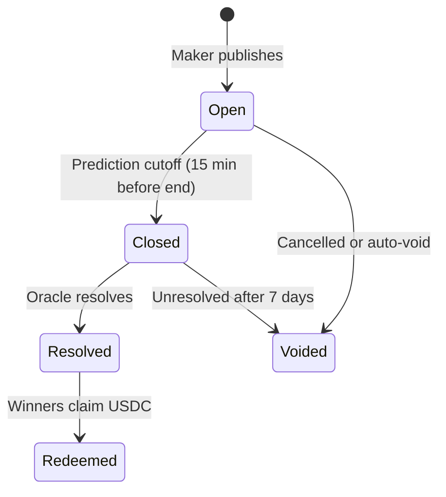

## Markets

A **market** is a tradeable question with exactly two outcomes: **YES** and **NO**. Examples:

- "Will Team A beat Team B?"
- "Will BTC close above \$100k in the next hour?"
- "Will this pump.fun coin graduate?"
- "Will this [pump.fun](http://pump.fun) coin hit a certain price level after 1 hour?"

Each market has:

| Property | Description |
| --- | --- |
| **Title & rules** | What is being predicted and how it resolves |
| **Expiry** | When trading closes (typically 15 minutes before the event ends) |
| **Venue** | AMM or CLOB (see [Venues](/concepts/venues)) |
| **Resolution source** | The authoritative data used to settle the market |

## Events

An **event** groups related markets under one real-world occurrence. On the sports vertical, an event is a match; you might see moneyline, spread, and total markets under the same fixture.

Navigate to an event at `/event/[slug]` for sports or `/crypto/event/[gameId]` for crypto price events.

## Product verticals

### Sports (`/sports`)

Soccer-focused predictions with match cards, game lines, and live event pages. Markets are tied to fixtures from external sports data feeds.

### Crypto (`/crypto`)

Short-horizon price markets including **BTC Up/Down** (`/crypto/updown`). Events resolve against spot price feeds.

### Pump.fun (`/pumpfun`)

**Synthetic markets** on pump.fun coins. Binary questions published on ezpz, not the raw pump.fun coin feed. Makers and community members author markets; the platform factory also publishes trending market cap threshold markets.

| Shape | Example |
| --- | --- |
| Graduation | Will this coin graduate by Friday? |
| Market-cap threshold | Will it cross \$5m market cap by Friday? |
| 5-minute up/down | Will it be Up or Down at 18:35 UTC? |

Authors can optionally link their pump.fun creator wallet for a **Verified creator** badge(if they choose to). See [Pump.fun markets](/concepts/pumpfun-markets) and [For pump.fun creators & community](/guides/pumpfun-creators).

<Note>
  Parlay legs are currently limited to soccer markets. Cross-vertical parlays are planned for a later release.
</Note>

## Market lifecycle

| State | What it means |
| --- | --- |
| **Open** | Players can place trades |
| **Closed** | Prediction cutoff passed; no new predictions |
| **Resolved** | Winning side declared; 24h dispute window |
| **Redeemed** | Winners have claimed USDC |
| **Voided** | Market cancelled; refunds available |

## Market URLs

| Vertical | URL pattern | Example |
| --- | --- | --- |
| Sports event | `/event/[slug]` | Match page with all lines |
| Crypto event | `/crypto/event/[gameId]` | BTC up/down session |
| Pump.fun | `/pumpfun/[slug]` | Maker-created coin market |
| Authoring | `/authoring` | Maker market wizard |

Slugs are human-readable identifiers generated at publish time.

## Resolution rules

Every market declares a **resolution source**, the authoritative data used to settle. Examples:

| Market type | Typical source |
| --- | --- |
| Soccer | Official match result from sports data feed |
| Crypto price | Spot price at expiry from configured feed |
| Pump.fun | pump.fun APIs and market-cap snapshots; graduation flag, mcap at expiry, or up/down price vs reference |

Rules are visible on the market detail page before you trade. See [Resolution](/concepts/resolution).

## Who creates markets

In the current release, only **makers** can create and publish markets through the authoring wizard (`/authoring`). Players browse and trade on published markets.

Factory markets (sports, crypto, pump.fun trending) are created automatically from data feeds. Maker and community markets (pump.fun custom shapes, other custom) are authored manually via `/authoring`.