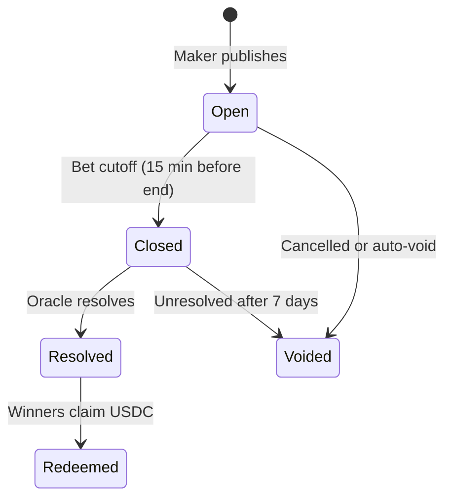

## Markets

A **market** is a tradeable question with exactly two outcomes: **YES** and **NO**. Examples:

- "Will Team A beat Team B?"
- "Will BTC close above $100k in the next hour?"
- "Will this pump.fun coin graduate?"

Each market has:

| Property | Description |
|----------|-------------|
| **Title & rules** | What is being predicted and how it resolves |
| **Expiry** | When betting closes (typically 15 minutes before the event ends) |
| **Venue** | AMM or CLOB (see [Venues](/concepts/venues)) |
| **Resolution source** | The authoritative data used to settle the market |

## Events

An **event** groups related markets under one real-world occurrence. On the sports vertical, an event is a match; you might see moneyline, spread, and total markets under the same fixture.

Navigate to an event at `/event/[slug]` for sports or `/crypto/event/[gameId]` for crypto price events.

## Product verticals

### Sports (`/sports`)

Soccer-focused betting with match cards, game lines, and live event pages. Markets are tied to fixtures from external sports data feeds.

### Crypto (`/crypto`)

Short-horizon price markets including **BTC Up/Down** (`/crypto/updown`). Events resolve against spot price feeds.

### Pump.fun (`/pumpfun`)

Maker-created markets on pump.fun coins. The maker verifies on-chain creator identity when publishing.

<Note>
  Parlay legs are currently limited to soccer markets. Cross-vertical parlays are planned for a later release.
</Note>

## Market lifecycle

| State | What it means |
|-------|---------------|
| **Open** | Players can place trades |
| **Closed** | Bet cutoff passed; no new bets |
| **Resolved** | Winning side declared; 24h dispute window |
| **Redeemed** | Winners have claimed USDC |
| **Voided** | Market cancelled; refunds available |

## Who creates markets

In the current release, only **makers** can create and publish markets through the authoring wizard (`/authoring`). Players browse and trade on published markets.
