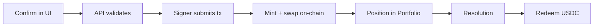
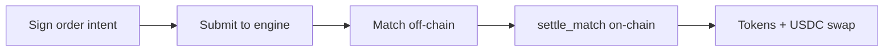

Every prediction on ezpz.fi follows a lifecycle from UI confirmation to Solana settlement. The path differs slightly between **AMM** (M1 default) and **CLOB** (coming soon).

## AMM lifecycle (M1)

| Step | Where | What happens |
|------|-------|--------------|
| 1. Confirm | Web app | You choose side, stake, and fees |
| 2. Validate | Off-chain API | Balance, cutoff, market status checks |
| 3. Submit | Custodial signer | `mint_tokens_v2` + AMM `swap` in one transaction |
| 4. Position | On-chain | YES or NO SPL tokens in your custodial ATA |
| 5. Resolve | On-chain + operator | `resolve_market` sets winning side |
| 6. Redeem | On-chain | Winners call `redeem` for USDC |

No wallet popup is required for custodial AMM trades after initial sign-in.

## CLOB lifecycle (v2 preview)

Polymarket-style order books use **hybrid-decentralized** settlement: matching off-chain, settlement on-chain.

| Step | Where | What happens |
|------|-------|--------------|
| 1. Sign | Client | Ed25519-signed `OrderIntent` (limit price, size, side) |
| 2. Submit | `clob-engine` | Order rests on book or matches immediately |
| 3. Match | Off-chain | Engine pairs compatible buy/sell orders |
| 4. Settle | `buukie-exchange` | Atomic token + USDC transfer between makers |
| 5. Confirm | Solana | Balances update; trade appears in history |

<Note>
  Retail CLOB trading is **not available in M1**. This section describes the upcoming v2 path. See [Venues](/concepts/venues).
</Note>

## Order types (CLOB preview)

When CLOB launches, orders will behave like standard limit-order books:

| Type | Behavior |
|------|----------|
| **Limit** | Rests on book until filled or cancelled |
| **Market-style** | Limit priced to execute immediately against resting orders |

## Status after submission

| Status | Meaning (AMM) |
|--------|---------------|
| **Pending** | Transaction submitted, awaiting confirmation |
| **Confirmed** | On-chain success; position visible in Portfolio |
| **Failed** | Transaction reverted; USDC not debited |

## Time gates

Trades are blocked when:

- **Prediction cutoff** — 15 minutes before event end
- **Market paused** — operator emergency pause
- **Insufficient balance** — not enough USDC in custodial wallet
- **Restricted region** — jurisdiction gating on certain products

See [Geographic restrictions](/resources/geographic-restrictions).

## Next steps

- [Place a prediction](/trading/place-prediction) — AMM walkthrough
- [Redeem tokens](/trading/redeem) — after resolution
- [Architecture](/concepts/architecture) — on-chain vs off-chain detail
