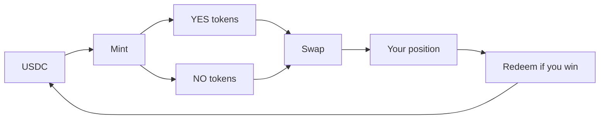

## Outcome tokens

When you make a prediction on ezpz.fi, you hold **outcome tokens** — SPL tokens on Solana representing YES or NO on a specific market. This is similar to Polymarket's Conditional Token Framework (CTF), adapted for Solana SPL mints.

| Token | Pays if… | Value at resolution |
|-------|----------|---------------------|
| **YES** | Outcome occurs | $1.00 USDC |
| **NO** | Outcome does not occur | $1.00 USDC |

## Mint, swap, redeem

The basic flow:

1. **Mint** — Deposit USDC to receive equal YES + NO tokens (minus fees).
2. **Swap** — Trade one side via the AMM to take a directional position.
3. **Hold or redeem** — Keep tokens until resolution, then redeem winners for USDC.

Advanced users can also **split** (mint without swapping) or **merge** (combine YES + NO back to USDC) when NegRisk multi-outcome markets launch. M1 uses the mint-and-swap path for all retail predictions.

## Custodial holdings

Your tokens live in a **custodial wallet** managed by the platform. You see balances in **Portfolio** (`/portfolio`) without managing SPL token accounts yourself.

<Note>
  You sign in with your personal Solana wallet for authentication. The custodial wallet executes trades on your behalf.
</Note>

## Positions

A **position** is your net exposure on a market — typically all YES or all NO tokens after swapping. Portfolio shows:

- Open positions with current implied value
- Unrealized P&amp;L
- Settlement status after resolution

## How payouts work

Each market has an isolated **USDC vault**. When you win:

- You burn your winning tokens via `redeem`
- USDC flows from the market vault to your custodial wallet
- Losers' stakes in the same vault fund the payout

The platform treasury and maker wallets do **not** pay winners directly. Markets are self-funded escrows.

<Tip>
  See [Resolution](/concepts/resolution) for the full settlement timeline. To exit early, see [Sell a prediction](/trading/sell-prediction) or [Surrender](/trading/surrender). For voided markets, see [Refunds](/trading/refund).
</Tip>

## Parlay positions

Parlay predictions are separate from single-market positions. They are backed by the parlay LP pool, not individual market vaults. See [Parlays](/concepts/parlays).
