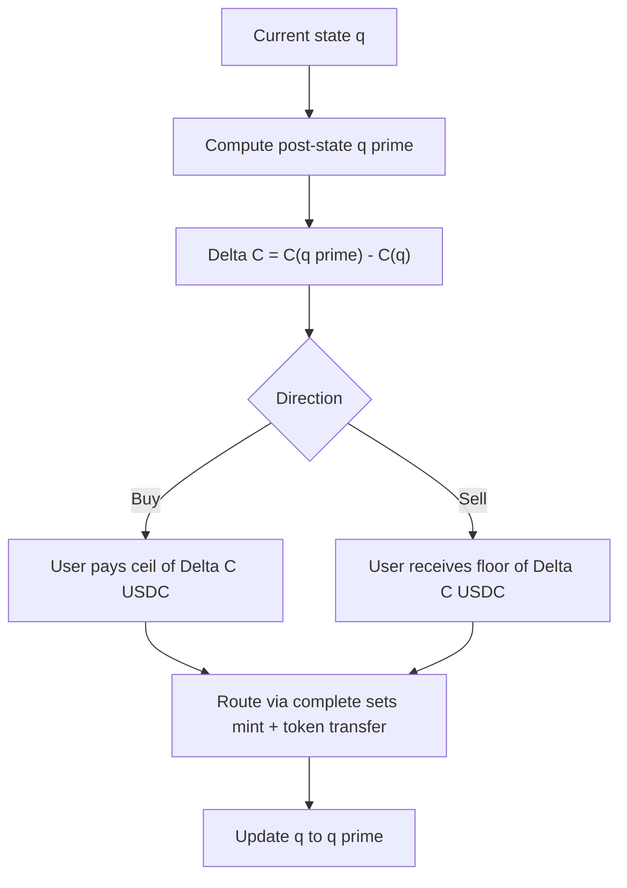

## Implied probability

Market prices represent implied probability. A YES token trading at **45¢** implies roughly a 45% chance the outcome occurs. YES \+ NO prices should sum to approximately \$1.00 (plus the overround fee).

## The AMM venue

Most markets today trade through an **automated market maker (AMM)** — a pool of YES and NO tokens that sets prices based on supply and demand.

| Property | Behavior |
| --- | --- |
| **Pricing** |  |
| **Legacy** | Constant-product (CPMM) pools are being phased out |
| **Swap fee** | 0.3% retained in the pool (LP profit) |
| **Slippage** | Larger trades move the price more |

When you place a prediction:

1. USDC is minted into YES \+ NO tokens (fees skimmed).
2. You swap away the side you do not want.
3. The AMM price updates for the next trader.

## LS-LMSR in depth

ezpz.fi prices AMM trades with **LS-LMSR** — _liquidity-sensitive Logarithmic Market Scoring Rule_ (Othman, Sandholm, Pennock, Reeves, EC 2010). It is a **cost-function market maker**: the pool tracks how many outcome tokens it has sold and charges USDC equal to the change in a convex cost function $C(q)$.

Compared to a static LMSR (fixed liquidity parameter $b$), LS-LMSR lets **depth grow with open interest**. More tokens outstanding → larger effective liquidity → smaller price impact per dollar traded. The trade-off is that vig (house edge) is **embedded in the pricing rule** rather than added as a separate fee on top.

### State

Each pool tracks binary quantities (in micro-token units):

$$
q = (q_{\text{yes}},\ q_{\text{no}})
$$

These are the net YES and NO tokens **sold by the pool since inception**, including the maker's seed quantities. There is no reserve-ratio formula like $x \cdot y = k$.

### Liquidity parameter

Liquidity scales with total outstanding quantity $T = q_{\text{yes}} + q_{\text{no}}$:

$$
b(q) = \alpha \,(q_{\text{yes}} + q_{\text{no}}) = \alpha T
$$

where $\alpha > 0$ is fixed at pool creation. When $\alpha$ is larger, the pool is **deeper** (more vig, less slippage). At uniform prices the total overround is approximately:

$$
p_{\text{yes}} + p_{\text{no}} = 1 + 2\alpha \ln 2
$$

So a target vig of $v$ cents implies:

$$
\alpha \approx \frac{v}{2 \ln 2}
$$

(e.g. $v = 0.05 \Rightarrow \alpha \approx 0.036$ for a ~5¢ overround at even odds).

### Cost function

The pool's cost function is the LS-LMSR log-sum-exp form:

$$
C(q) = b(q)\,\ln\!\left(e^{q_{\text{yes}}/b(q)} + e^{q_{\text{no}}/b(q)}\right)
$$

**Numerically stable equivalent** (used on-chain): let $m = \max(q_{\text{yes}}, q_{\text{no}})$, $d = m - \min(q_{\text{yes}}, q_{\text{no}})$, and $b = \alpha T$. Then:

$$
C(q) = m + b\,\ln\!\left(1 + e^{-d/b}\right)
$$

Only the **difference** $d/b$ is exponentiated, which keeps fixed-point math safe at large $T$.

### Trade pricing algorithm

Trades are **not** priced at a displayed marginal quote. The economic rule is always the cost-function difference.

**Buy** $\Delta$ tokens of side $i$ (e.g. YES):

$$
\text{cost} = C(q_i + \Delta,\ q_{\neg i}) - C(q_{\text{yes}}, q_{\text{no}})
$$

**Sell** $\Delta$ tokens of side $i$:

$$
\text{payout} = C(q_{\text{yes}}, q_{\text{no}}) - C(q_i - \Delta,\ q_{\neg i})
$$

On-chain, USDC amounts are rounded **in the pool's favor** (buys rounded up, sells rounded down).

Because $C$ is **convex**, $\Delta C$ per token rises as you trade more in one direction — that is AMM slippage.

### Marginal prices (display only)

The **marginal price** of side $i$ is the partial derivative:

$$
p_i = \frac{\partial C}{\partial q_i}
$$

For binary LS-LMSR, the gradient includes an extra $\alpha$ term because $b$ depends on $q$. In scale-free coordinates $u = q_{\max}/T$ and $w = e^{-d/b}$:

$$
p_{\max} = u + g + (1-u)\frac{1-w}{1+w}, \qquad
p_{\min} = u + g - u\frac{1-w}{1+w}
$$

where $g = \alpha \ln(1+w)$.

Properties:

$$
p_{\text{yes}} + p_{\text{no}} = 1 + v(q) \geq 1
$$

The excess $v(q) \geq 0$ is **embedded vig** — it accrues to pool NAV, not a separate skim. At heavy skew the favorite's raw marginal price can exceed \$1; charts clamp display to $(0,1)$ but **trades still use** $\Delta C$.

### Implied fair probability

When a maker seeds at "60¢ YES", that means the **vig-free softmax probability**, not the vig-inclusive marginal:

$$
\sigma_{\text{yes}} = \frac{e^{q_{\text{yes}}/b}}{e^{q_{\text{yes}}/b} + e^{q_{\text{no}}/b}}
= \frac{1}{1 + e^{-(q_{\text{yes}} - q_{\text{no}})/b}}
$$

This $\sigma$ is what "60% odds" means in the authoring UI. Raw marginals $p_i$ sit at or above $\sigma_i$ — the spread is the rule's built-in margin.

### Seeding at chosen odds

At pool creation the maker supplies seed USDC $S$ and declared probability $p^*$ (in basis points). The program derives initial $(q_{\text{yes}}, q_{\text{no}})$ so that:

1. $\sigma_{\text{yes}} \approx p^*$ (within one price tick), and
2. **Worst-case loss** is bounded by the seed.

Let $P = \max(p^*, 1-p^*)$, logit $L = \ln\!\big(P/(1-P)\big)$, and $\rho = (1-P)/P$. Define:

$$
K = L + \ln(1+\rho), \qquad T = \frac{S}{\alpha K}
$$

Then assign total quantity $T$ across sides with skew $\alpha T L = q_{\max} - q_{\min}$, putting $q_{\max}$ on YES when $p^* \geq \tfrac{1}{2}$.

The **worst-case loss** at the seed state is:

$$
\text{WCL}(q_0) = C(q_0) - \min(q_{\text{yes},0}, q_{\text{no},0}) = \alpha T \ln\!\frac{1}{1-P} \leq S
$$

That is why seed USDC is the maker's **collateral against subsidy** — the pool cannot lose more than the seed in the adversarial orthant bound.

### Why depth grows with volume

Static LMSR keeps $b$ fixed, so a popular market eventually becomes **too shallow** — each marginal trade moves prices sharply.

LS-LMSR ties $b = \alpha T$ to open interest. As players buy YES or NO:

$$
T = q_{\text{yes}} + q_{\text{no}} \uparrow \quad \Rightarrow \quad b \uparrow
$$

A larger $b$ flattens the cost curve locally, so **the same \$ stake moves prices less** after the market has absorbed more flow. Depth is endogenous to activity, not a fixed constant set only at launch.

| Quantity | Effect on depth |
| --- | --- |
|  |  |
|  |  |
|  |  |

### What you see in the UI

| Display | Math object | Notes |
| --- | --- | --- |
| **Current price** | Orientation: buying YES raises YES price |  |
| **Trade preview** | Includes slippage \+ embedded vig |  |
| **Fees row** | Platform/maker fees on mint path |  |

See [Architecture](/concepts/architecture) for on-chain program layout and [Venues](/concepts/venues) for AMM vs CLOB.

## Liquidity

**Makers** seed initial liquidity when publishing a market. The pool holds balanced YES/NO reserves. LP providers earn swap fees from every trade regardless of who wins the market.

<Warning>
  If you remove liquidity after a market resolves, tokens on the losing side are worthless. The UI warns before LP exit on resolved markets.
</Warning>

## Price display

On market and event pages you see:

- **Current price** — best available AMM price for each side
- **Trade preview** — stake, fees, shares received, and potential payout before you confirm
- **Charts** — price history where available (sports and crypto events)

## CLOB pricing (future)

Order-book markets will show bid/ask spreads and depth instead of AMM curves. CLOB trading is not available to players yet. See [Venues](/concepts/venues).