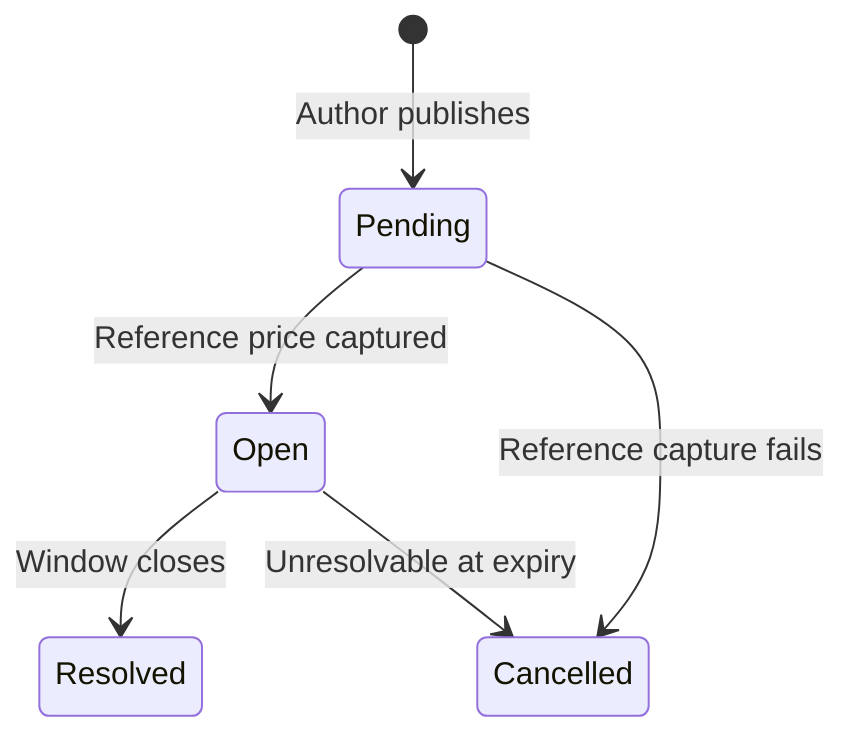

## What pump.fun markets are

**Pump.fun markets** are binary prediction questions tied to a specific pump.fun coin mint. Each market asks whether something will happen to that coin i.e. graduate from the bonding curve, cross a market-cap target, or finish a five-minute window up or down.

Unlike the raw pump.fun coin feed, ezpz.fi only lists **platform-created markets**. A coin appears on `/pumpfun` only after a maker or the platform publishes a market for it. You never browse coins that have no tradeable question on ezpz. Creators can let their creative juices run wild to open the most interesting markets.

<Note>
  Pump.fun markets cannot be used as parlay legs yet. Parlays are sports-only today. Use single predictions on pump.fun markets. See [Parlays](/concepts/parlays).
</Note>

## Synthetic markets

Sports and crypto factory markets map to external fixtures (a match ID, a price bar). Pump.fun markets use **synthetic keys** instead, internal identifiers built from the coin mint, market shape, and expiry window. This lets multiple questions coexist on the same coin without colliding:

| Shape | Example question | What resolves it |
| --- | --- | --- |
| **Graduation** | Will MOON graduate by Friday? | Coin's `graduated` flag at expiry |
| **Market-cap threshold** | Will MOON cross \$5m market cap by Friday? | Recorded USD market cap at expiry |
| **5-minute up/down** | Will MOON be Up or Down at 18:35 UTC? | Coin price vs a reference captured at window open |

Each shape has fixed resolution rules baked in at creation. Players see the rules on the market detail page before trading.

## Who creates markets

| Source | Who | What they publish |
| --- | --- | --- |
| **Maker / community author** | Any signed-in maker (or player who switches to maker) | Graduation, market cap-threshold, or 5-minute up/down markets on a chosen coin |
| **Platform factory** | Automated cron on trending coins | Market cap-threshold markets only, one per coin while no open market exists |

Community members do not need to be the coin's pump.fun creator to publish. Anyone with a maker account can author a market on any coin mint. Optional **verified creator** status is a badge, not a gate. This would signify and distinguish the level of authenticity for traders. See [For pump.fun creators & community](/guides/pumpfun-creators).

## Verified creator badge

When a market's author has linked their Phantom wallet to the coin's on-chain creator address, the market shows a **Verified creator** chip. This signals that the person who minted the coin on pump.fun is the same account publishing the market.

| State | Meaning |
| --- | --- |
| **Verified creator** | Author completed the wallet-link flow for this coin mint |
| **No badge** | Author is a community member, or has not linked yet |

The badge is derived server-side. Clients cannot forge it by passing a flag.

## Market shapes in detail

### Graduation (Yes / No)

- **Question:** Will \<COIN\> graduate by \<date\>?
- **Resolves YES** if the coin has graduated from pump.fun's bonding curve at expiry.
- **Resolves NO** otherwise.
- **Trading:** Open immediately after publish and seed.

### Market-cap threshold

- **Question:** Will \<COIN\> cross \$\<N\>m mcap by \<date\>?
- **Author picks** the threshold (whole USD) and expiry.
- **Resolves YES** if recorded USD market cap at expiry is **≥** the threshold.
- **Validation:** Threshold should be at least ~1% above current mcap when authored (skipped if pump.fun is temporarily unreachable).
- **Trading:** Open immediately after publish and seed.

### 5-minute up / down

- **Question:** Will \<COIN\> be Up or Down at \<HH:MM UTC\>?
- **Reference price ("Price to Beat")** is captured automatically at window open — not chosen by the author.
- **Window:** Five-minute slots aligned to UTC (`:00`, `:05`, `:10`, …).
- **Lead time:** Window must open between 1 and 30 minutes from authoring.
- **Resolves UP (YES)** if final price **≥** reference; **DOWN (NO)** otherwise. Ties count as Up.
- **Trading:** Market starts in **Pending** until the reference locks, then opens for the five-minute window. You cannot bet while pending.

## Where data comes from

Pump.fun markets resolve from **pump.fun API data**, not on-chain oracle networks:

| Data | Source | Used for |
| --- | --- | --- |
| Coin metadata | pump.fun read proxy | Names, images, creator wallet |
| Graduation flag | Live pump.fun lookup | Graduation markets |
| USD market cap | Snapshot recorder (60s cadence) | Market cap-threshold markets |
| Price (market cap ÷ supply) | pump.fun lookup at window open and close | Up/down markets |

Automated crons resolve factory and deterministic shapes. Operators can still review edge cases in oracle-admin. See [Architecture](/concepts/architecture) for the full vertical map.

## Economics

There is a small **authoring fee** for pump.fun markets, we call this the creator fee. The maker's **AMM seed liquidity** is the commitment, USDC collateral that backs the binary payout, the same as other maker markets. For example, if you are opening a new market, it will cost eg, 1.2Sol. Breakdown would be 1Sol straight into seed liquidity for your market and 0.2Sol goes to platform liquidity pool, used to bolster and boost ecosystem markets. 

| Item | Detail |
| --- | --- |
| **Seed requirement** | Standard minimum seed USDC applies |
| **Maker fee** | 0.5–5% on each prediction (you configure) |
| **Platform fee** | Embedded in AMM overround |

## URLs and navigation

| Page | Route | Purpose |
| --- | --- | --- |
| Pump.fun feed | `/pumpfun` | Grid of platform-created coin markets |
| Coin event | `/pumpfun/[slug]` | Chart, markets list, trade panel |
| Author coin | `/authoring/coin` | Create a market on a pump.fun mint |
| Maker dashboard | `/authoring` | Publish status, seed liquidity, fees |

## Related guides

<CardGroup cols={2}>
  <Card title="For pump.fun creators & community" icon="user-pen" href="/guides/pumpfun-creators">
    Author markets, link your creator wallet, seed liquidity.
  </Card>

  <Card title="Trade pump.fun markets" icon="ticket" href="/trading/pumpfun-predictions">
    Browse, read pending windows, and place predictions.
  </Card>

  <Card title="For makers" icon="store" href="/guides/makers">
    General maker onboarding and fee claiming.
  </Card>

  <Card title="Resolution" icon="gavel" href="/concepts/resolution">
    Settlement timeline, disputes, and redemption.
  </Card>
</CardGroup>