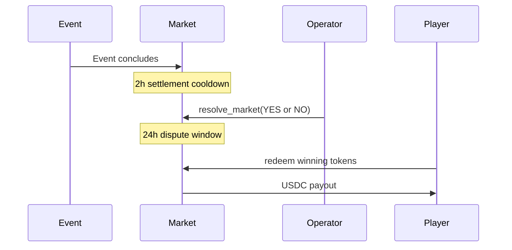

## Who resolves markets

**Operators** resolve markets through the oracle-admin console, a separate application from the public ezpz.fi site. Operators review evidence, compare against the declared resolution source, and submit the winning outcome on-chain.

## Resolution timeline

| Rule | Duration | Effect |
| --- | --- | --- |
| **Prediction cutoff** | 15 min before event end | No new predictions or mints |
| **Settlement cooldown** | 2 hours after expiry | Operator cannot resolve yet |
| **Dispute window** | 24 hours after resolution | Redemption blocked; disputes can be filed |
| **Auto-void** | 7 days after expiry | Permissionless void if still unresolved |

## Redemption

After the dispute window passes, winners redeem their tokens:

- Winning tokens → 1 USDC each (from the market vault)
- Losing tokens → \$0

Redemption is executed on-chain through your custodial wallet. See [Redeem tokens](/trading/redeem) for the player walkthrough.

| Phase | Can you redeem? |
| --- | --- |
| Open / Closed | No — wait for resolution |
| Resolved (dispute window active) | No — 24h hold |
| Resolved (dispute window passed) | Yes — winning tokens only |
| Voided | Refund, not redeem |

## Disputes {#disputes}

If a resolution looks incorrect, you can **file a dispute** within **24 hours** of on-chain resolution:

<Steps>
  <Step title="Open Portfolio">
    Find the resolved market in **Portfolio** (`/portfolio`).
  </Step>
  <Step title="File dispute">
    Use the **Dispute** action and describe why the outcome is wrong.
  </Step>
  <Step title="Wait for review">
    Operators review in oracle-admin and either uphold or overturn the result.
  </Step>
</Steps>

During a dispute, **redemption is blocked** for all participants on that market. Makers can also file disputes on their own markets.

Operators review disputes in the oracle-admin console and either:

- **Uphold** — confirm the original outcome
- **Overturn** — correct the outcome

During a dispute, redemption is blocked for all participants on that market.

## Voided markets

A market may be **voided** if:

- An operator cancels it before resolution
- It remains unresolved 7 days after expiry (auto-void)

Voided markets enable **refunds**, participants recover their stake instead of a winning side being declared.

## Transparency

Resolution transactions are on-chain and visible in Solana explorers. The oracle-admin **Audit** log records every operator action with timestamps.