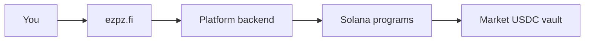

## What is ezpz.fi?

ezpz.fi is a prediction market where you trade on real-world outcomes — sports matches, crypto price moves, pump.fun coins, and more. Markets settle on Solana. You sign in once; the platform handles on-chain execution through a custodial wallet so you can bet without approving every transaction.

<CardGroup cols={2}>
  <Card title="Quickstart" icon="rocket" href="/quickstart">
    Create an account and place your first bet in minutes.
  </Card>
  <Card title="Core concepts" icon="book-open" href="/concepts/markets-events">
    Understand markets, tokens, prices, and resolution.
  </Card>
  <Card title="For players" icon="user" href="/guides/players">
    Browse markets, trade, and manage your portfolio.
  </Card>
  <Card title="For makers" icon="store" href="/guides/makers">
    Create markets, seed liquidity, and earn fees.
  </Card>
</CardGroup>

## Product verticals

| Vertical | What you trade on | Route |
|----------|-------------------|-------|
| **Sports** | Soccer match outcomes | `/sports`, `/event/[slug]` |
| **Crypto** | BTC up/down and price events | `/crypto` |
| **Pump.fun** | Maker-created coin markets | `/pumpfun` |
| **Parlays** | Multi-leg accumulators (soccer) | `/parlay` |

## How trading works

1. You deposit USDC into your custodial wallet.
2. You pick a side (YES or NO) on a market.
3. The platform mints outcome tokens and routes your trade through the AMM.
4. When the market resolves, winners redeem USDC from the market vault.

<Note>
  ezpz.fi does not offer a public API for third-party integrations. All trading happens through the web app.
</Note>

## Who this documentation is for

- **Players** — place single bets and parlays, track positions, withdraw funds
- **Makers** — create and publish markets, configure odds, earn maker fees
- **Operators** — resolve markets, handle disputes, manage treasury (oracle-admin console)

## On-chain transparency

Every market, bet, and payout is recorded on Solana. You do not need to interact with the chain directly — but settlement is verifiable on-chain. See [Outcome tokens](/concepts/outcome-tokens) and [Resolution](/concepts/resolution) for how vault accounting works.
