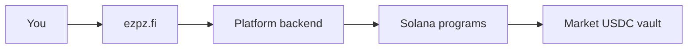

## What is ezpz.fi?

ezpz.fi is a prediction market where you trade on real-world outcomes — sports matches, crypto price moves, pump.fun coins, and more. Prices reflect collective belief about what will happen. Markets settle on **Solana** with **USDC** collateral.

You sign in once; the platform handles on-chain execution through a **custodial wallet** so you can make predictions without approving every transaction.

<CardGroup cols={2}>
  <Card title="ezpz 101" icon="graduation-cap" href="/ezpz-101">
    New to prediction markets? Start here.
  </Card>
  <Card title="Quickstart" icon="rocket" href="/quickstart">
    Connect your wallet and place your first prediction.
  </Card>
  <Card title="Core concepts" icon="book-open" href="/concepts/markets-events">
    Markets, tokens, prices, and resolution.
  </Card>
  <Card title="For players" icon="user" href="/guides/players">
    Browse markets, trade, and manage your portfolio.
  </Card>
  <Card title="For makers" icon="store" href="/guides/makers">
    Create markets, seed liquidity, and earn fees.
  </Card>
  <Card title="Portfolio" icon="chart-pie" href="/guides/portfolio">
    Track positions, P&amp;L, and settlement actions.
  </Card>
  <Card title="Account & security" icon="lock" href="/guides/account-security">
    MFA, email, and player vs maker roles.
  </Card>
</CardGroup>

## How it works

| Step | What happens |
|------|--------------|
| **1. Deposit** | Fund your custodial wallet with USDC |
| **2. Predict** | Buy YES or NO on a market via the AMM |
| **3. Hold or exit** | Wait for resolution, sell, or surrender early |
| **4. Redeem** | Winning tokens pay $1.00 USDC each |

## Product verticals

| Vertical | What you trade on | Route |
|----------|-------------------|-------|
| **Sports** | Soccer match outcomes | `/sports`, `/event/[slug]` |
| **Crypto** | BTC up/down and price events | `/crypto` |
| **Pump.fun** | Maker-created coin markets | `/pumpfun` |
| **Parlays** | Multi-leg accumulators (soccer) | `/parlay` |

## Key concepts

<CardGroup cols={2}>
  <Card title="Markets & events" icon="calendar" href="/concepts/markets-events">
    How questions are structured and grouped.
  </Card>
  <Card title="Outcome tokens" icon="coins" href="/concepts/outcome-tokens">
    YES/NO SPL tokens and positions.
  </Card>
  <Card title="Prices & AMM" icon="chart-line" href="/concepts/prices-amm">
    How odds and pool pricing work.
  </Card>
  <Card title="Resolution" icon="gavel" href="/concepts/resolution">
    Settlement, disputes, and redemption.
  </Card>
</CardGroup>

## Who this documentation is for

- **Players** — place single predictions and parlays, track positions, withdraw funds
- **Makers** — create and publish markets, configure odds, earn maker fees
- **Operators** — resolve markets, handle disputes, manage treasury (oracle-admin console)

<Note>
  ezpz.fi does not offer a public API for third-party integrations. All trading happens through the web app.
</Note>

## On-chain transparency

Every market, prediction, and payout is recorded on Solana. You do not need to interact with the chain directly — but settlement is verifiable on-chain. See [Smart contracts](/resources/contracts), [On-chain data](/resources/blockchain-data), [Architecture](/concepts/architecture), and [Order lifecycle](/concepts/order-lifecycle).
