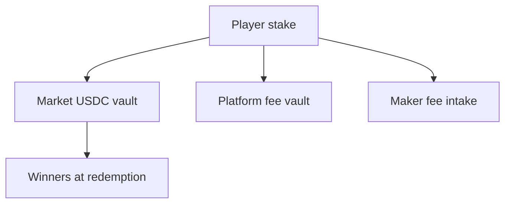

## Three fees on single bets

ezpz.fi uses **three distinct fees** on single-market bets. They are collected at different stages and never conflated:

| Fee | Rate | Collected at | Goes to |
|-----|------|--------------|---------|
| **Platform overround** | 1–5% (configurable) | Mint (`mint_tokens`) | Platform fee vault → treasury |
| **Maker fee** | 0.5–5% (maker sets) | Mint (`mint_tokens`) | Maker fee intake → maker wallet |
| **AMM swap fee** | 0.3% | Swap | Retained in AMM pool (LP profit) |

## Example — $100 bet

With 3% platform overround and 2% maker fee:

| Line item | Amount |
|-----------|--------|
| You pay | $100.00 |
| Platform fee | $3.00 |
| Maker fee | $2.00 |
| Into market vault | $95.00 |
| AMM swap fee | ~0.3% of swap (tiny, stays in pool) |

You receive outcome tokens backed by the $95.00 net stake (minus swap slippage).

## Parlay fee

Parlays charge a separate **2% fee** on the stake, deducted before odds are applied:

```
Net stake = stake − (stake × 2%)
Max payout = net_stake × combined_odds / 100
```

## Surrender deductions

When you surrender (cash out) before an event ends, a **surrender deduction** applies. The maker configures this percentage (default 50%):

```
$100 bet, 50% surrender deduction:
  You receive:    $50
  Maker keeps:    $45
  Platform fee:   $5
```

## Who pays whom



Key points:

- **Winners are paid from the market vault**, not from the platform treasury or maker wallet.
- Platform and maker fees are skimmed **up front** at mint time.
- Losers' stakes remain in the vault and fund winners at resolution.

## LP earnings

Makers who seed AMM liquidity earn the **0.3% swap fee** on every trade, win or lose. LP positions also settle at resolution like any other token holder — the losing side of the pool goes to zero.

<Warning>
  Removing liquidity after a market resolves can leave you holding worthless tokens on the losing side. The UI warns before LP exit on resolved markets.
</Warning>

## Fee transparency

The trade panel and parlay slip show all fees before you confirm. There are no hidden charges beyond what is displayed in the preview.

## What ezpz.fi does not charge

- No deposit fee (bridge/network fees may apply separately)
- No withdrawal fee from the platform (Solana network fees apply)
- No subscription or account maintenance fee
