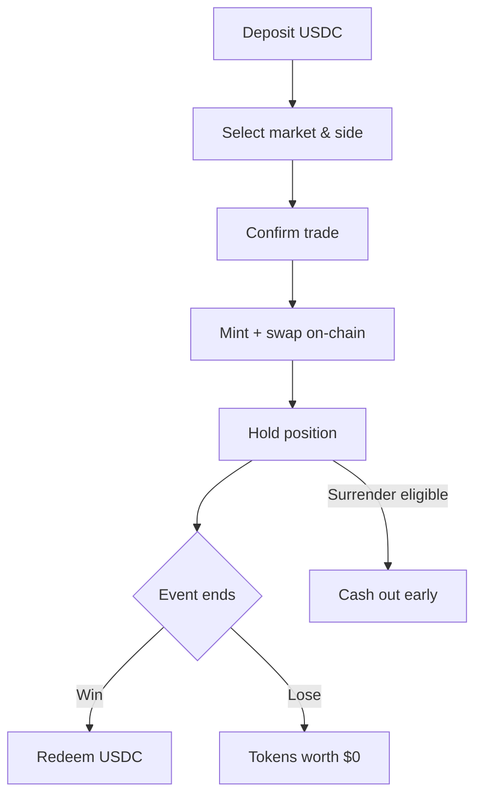

## Custodial trading

ezpz.fi uses a **custodial-first** model:

1. You sign in with your Solana wallet once.
2. The platform holds a custodial keypair linked to your account.
3. When you confirm a bet in the UI, the platform submits the on-chain transaction — no wallet popup per trade.

This keeps the experience fast while settlement remains on Solana.

<Note>
  ezpz.fi does not offer a public API. All trading happens through the web app at [ezpz.fi](https://ezpz.fi).
</Note>

## Single bets vs parlays

| Type | Funding source | How odds work |
|------|----------------|---------------|
| **Single bet** | Market USDC vault via AMM | Price at time of trade |
| **Parlay** | Parlay LP pool | Leg odds multiplied together |

See [Place a bet](/trading/place-bet) and [Build a parlay](/trading/build-parlay).

## The bet lifecycle

## Execution venue

M1 retail trading uses the **AMM**. You swap against a liquidity pool at the current price. See [Venues](/concepts/venues) for the upcoming CLOB.

## Fees

Three separate fees apply at different stages. They are never combined into one line item:

| Fee | When | Rate |
|-----|------|------|
| Platform overround | Mint | 1–5% |
| Maker fee | Mint | 0.5–5% (maker sets) |
| AMM swap fee | Swap | 0.3% |
| Parlay fee | Parlay stake | 2% |

Full breakdown: [Fees](/trading/fees).

## Money flow

Each market is an isolated escrow:

- Players deposit USDC at mint time (fees skimmed to platform and maker vaults).
- The remaining USDC sits in the market vault.
- Winners redeem from that vault after resolution.
- Losers' stakes fund winners — there is no house bankroll covering payouts.

## Time rules

| Rule | Cutoff |
|------|--------|
| New bets | 15 min before event end |
| Surrender | 20 min before event end |
| Resolution | 2h after expiry (operator) |
| Redemption | After 24h dispute window |

## Portfolio

Track everything in **Portfolio** (`/portfolio`):

- Open positions and unrealized P&amp;L
- Settled bets and realized P&amp;L
- Withdrawal history
