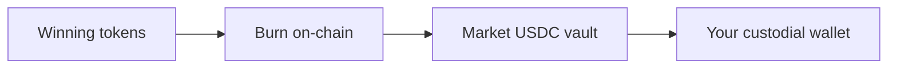

After a market **resolves**, winning outcome tokens can be redeemed for **$1.00 USDC each**. Losing tokens are worthless.

## Before you redeem

Check that:

1. The market status is **Resolved** (not Open or Voided)
2. The **24-hour dispute window** has passed (unless no dispute was filed)
3. No active **dispute** is blocking redemption
4. You hold **winning-side tokens** in Portfolio

See [Resolution](/concepts/resolution) for the full timeline.

## How redemption works

| Input | Output |
|-------|--------|
| 100 winning YES tokens | $100 USDC (from market vault) |
| 50 winning NO tokens | $50 USDC |

Redemption is executed on-chain via the `redeem` instruction. The platform submits the transaction through your custodial wallet — you do not need to sign each redemption manually.

## Voided markets

If a market is **voided** (cancelled), use [refund](/trading/refund) instead of redeem. All participants recover their stake rather than a winning side being declared.

## Parlays

Parlay payouts are separate from single-market redemption. When all legs resolve, the parlay pool pays winners via `settle_parlay`. See [Build a parlay](/trading/build-parlay).

## Example

You bought 200 YES tokens at an average of 45¢ ($90 total cost). Team A wins.

- Market resolves **YES**
- After dispute window: redeem 200 YES → **$200 USDC**
- Profit: $200 − $90 = **$110** (before fees at mint time)

<Tip>
  Track settled positions and P&amp;L in **Portfolio** (`/portfolio`).
</Tip>

## Related

- [Resolution](/concepts/resolution) — dispute window and operator flow
- [Outcome tokens](/concepts/outcome-tokens) — how tokens represent positions
- [USDC collateral](/concepts/usdc-collateral) — vault accounting
