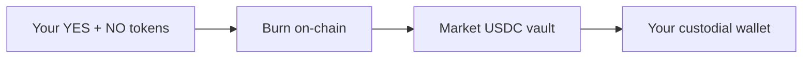

When a market is **voided**, there is no winning side. Instead of redeeming tokens for $1.00, participants **refund** their positions and recover USDC from the market vault.

## Void vs resolve

| Status | Outcome | What you do |
|--------|---------|-------------|
| **Resolved** | YES or NO wins | Winners [redeem](/trading/redeem) for $1.00 per token |
| **Voided** | No winner declared | All participants **refund** stake |

## When markets are voided

A market may be voided if:

- An **operator or maker** cancels it before or after the event
- It remains **unresolved 7 days** after expiry (permissionless auto-void)
- Integrity rules trigger a refund (e.g. maker ban with pending predictions)

See [Resolution](/concepts/resolution) for the full lifecycle.

## How refunds work

Refunds return your **net stake** — the USDC backing your position after mint-time fees were skimmed. Platform and maker fees collected at mint are not reversed.

## What you need to do

<Steps>
  <Step title="Check market status">
    Open the market or **Portfolio** (`/portfolio`). Status should show **Voided**.
  </Step>
  <Step title="Claim refund">
    Use the **Refund** action in Portfolio or on the market detail page when available.
  </Step>
  <Step title="Confirm balance">
    USDC returns to your custodial wallet after on-chain confirmation.
  </Step>
</Steps>

The platform submits the refund transaction through your custodial wallet — no per-action wallet popup.

## Parlays

If **all legs** of a parlay are voided, you receive a **full stake refund** from the parlay pool. If only some legs void, odds are recalculated on the remaining legs. See [Parlays](/concepts/parlays).

## Refund vs redeem

| Action | When | Result |
|--------|------|--------|
| **Refund** | Market voided | Recover stake; no winner declared |
| **Redeem** | Market resolved, you hold winners | $1.00 per winning token |

## Related

- [Redeem tokens](/trading/redeem) — after a normal resolution
- [Resolution & disputes](/concepts/resolution) — void rules and auto-void
- [Portfolio](/guides/portfolio) — track voided positions
